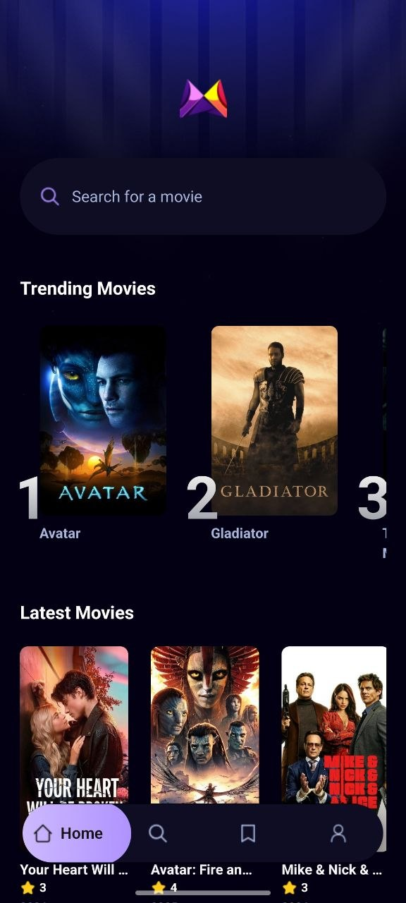

# 📽️ Mobile Movie App

## 📌 Overview

**Mobile Movie App** is a cross‑platform mobile application built with **React Native** and **Expo**, allowing users to browse movies, view details, and access various navigation and API integration features.

---

## 🛠 Tech Stack

| Technology                  | Purpose                                  |
| --------------------------- | ---------------------------------------- |
| **React Native**            | Framework for cross‑platform mobile apps |
| **Expo**                    | Tool for easy development & debugging    |
| **JavaScript / TypeScript** | Programming languages used               |
| **React Navigation**        | Screen navigation management             |
| **TMDB API** *(optional)*   | External movie data source               |

---

## 📁 Project Structure

```
/
├─ app/                      # Main application folder
├─ assets/                   # Static files (images, fonts, etc.)
├─ components/               # Reusable UI components
├─ constants/                # Constants, colors, configuration
├─ interfaces/               # TypeScript interfaces
├─ services/                 # API calls & backend logic
├─ types/                    # Custom TypeScript types
├─ README.md
├─ app.json                  # Expo configuration
├─ babel.config.js           # Babel compiler configuration
├─ package.json              # Dependencies & scripts
└─ …
```

---

## 🚀 Quick Start

### 1) Install dependencies

```bash
git clone https://github.com/nikolas-gou/mobile-movie-app.git
cd mobile-movie-app
npm install
```

---

### 2) Run the app

```bash
npx expo start
```

After running:

* The Metro bundler will open
* You can run the app on an Android/iOS emulator
* Or via **Expo Go** on your mobile device

---

## 🧠 Architecture & Code

### 📌 Routing / Navigation

Navigation is handled with **React Navigation** (Stack / Tabs), separating screens into files corresponding to routes for easy expansion.

### 🧩 Components

Reusable UI components are in the `components/` folder.
Each component handles UI logic and uses props to receive data.

### 🔁 Services & API

The `services/` folder contains functions for API calls, e.g.:

```js
export const fetchMovies = async () => {
  const response = await fetch(/* TMDB API endpoint */);
  return await response.json();
};
```

---

## 📷 Screenshots

### Home Screen



### Movie Details


---

## 🧪 Suggested Improvements

* **Search functionality** with live suggestions
* **Movie details screen** with trailers and ratings
* **Favorites list** (local or backend)
* **Offline caching**

---

## 📄 Contributing

1. Fork the repository
2. Create a new branch for your feature
3. Commit & push your changes
4. Submit a pull request

---

## 💬 Support / Contact

For feedback or documentation improvements, open an issue on GitHub.
